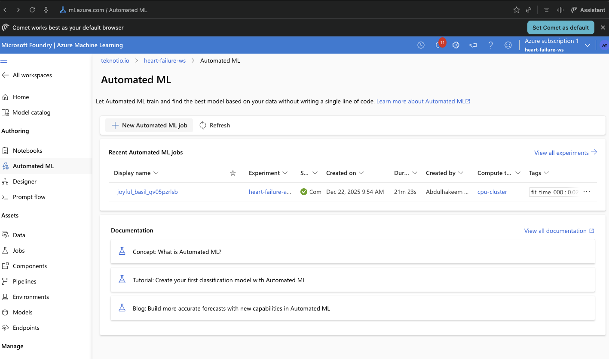
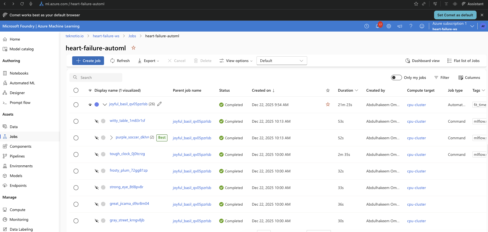
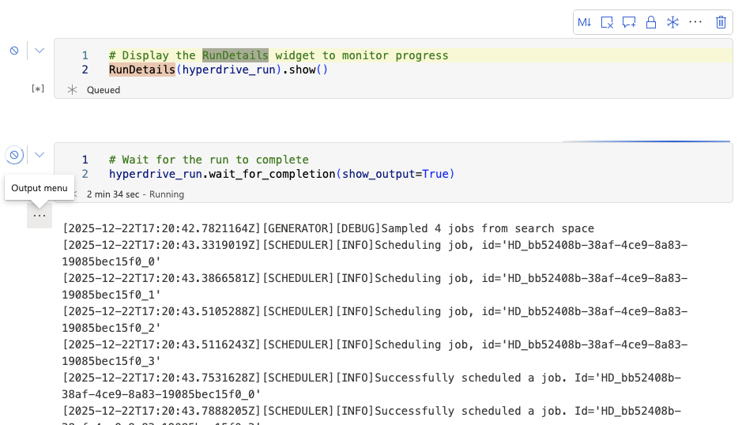
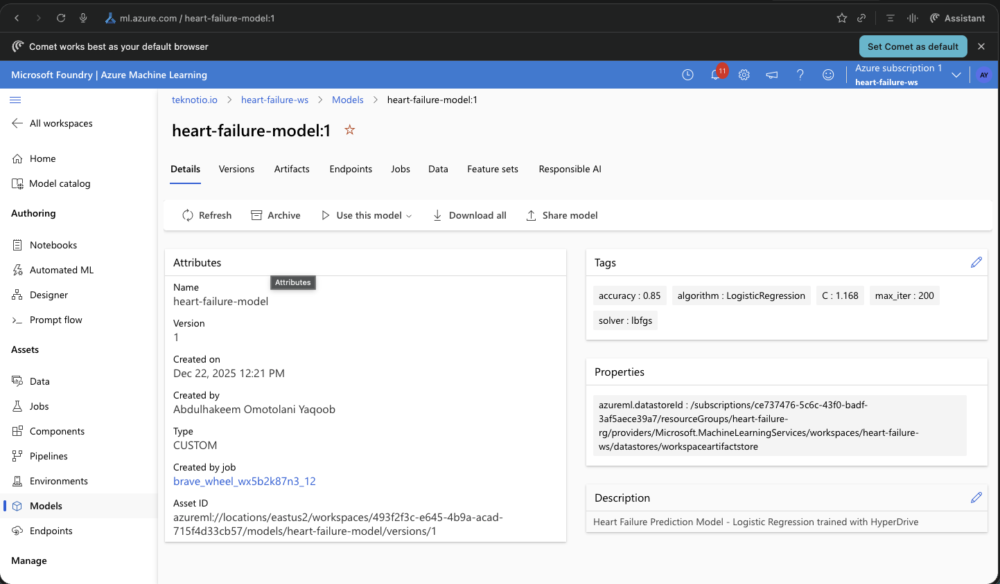
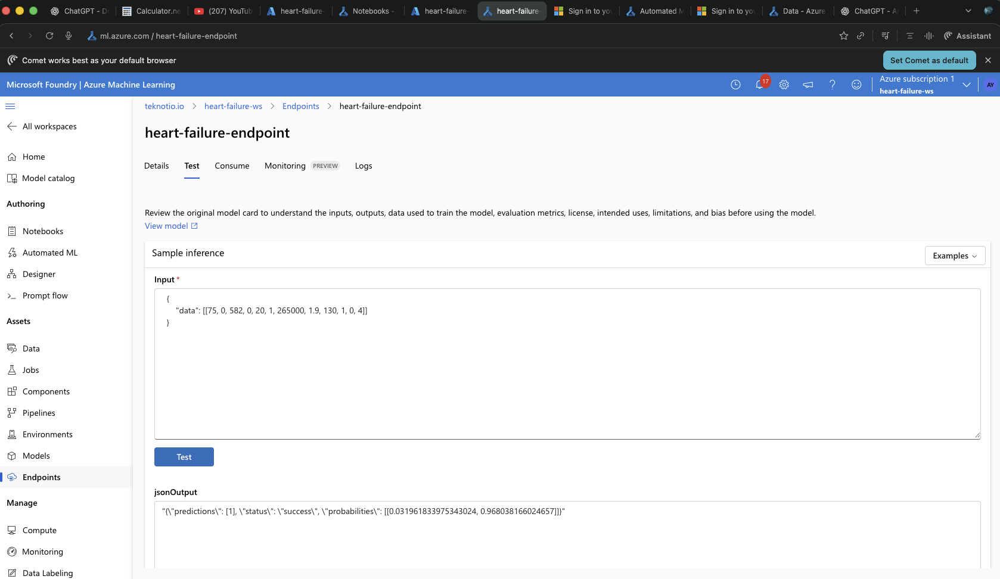

# Heart Failure Prediction with Azure Machine Learning

## Table of Contents
- [Project Overview](#project-overview)
- [Dataset](#dataset)
- [Project Architecture](#project-architecture)
- [Getting the Data into Azure ML](#getting-the-data-into-azure-ml)
- [AutoML Experiment](#automl-experiment)
- [HyperDrive Experiment](#hyperdrive-experiment)
- [Model Comparison](#model-comparison)
- [Model Deployment](#model-deployment)
- [Querying the Endpoint](#querying-the-endpoint)
- [Screen Recording](#screen-recording)
- [Future Improvements](#future-improvements)
- [Screenshots](#screenshots)

---

## Project Overview

This project demonstrates the use of Azure Machine Learning to build, compare, and deploy machine learning models for predicting heart failure mortality. The project implements two approaches:

1. **AutoML**: Automated machine learning that explores multiple algorithms and hyperparameters automatically
2. **HyperDrive**: Hyperparameter tuning for a Logistic Regression model using random sampling

The best performing model is then deployed as a web service endpoint for real-time predictions.

### Azure Resources Created

- **Workspace**: `heart-failure-ws`
- **Resource Group**: `heart-failure-rg`
- **Compute Cluster**: `cpu-cluster` (STANDARD_DS3_V2, max 4 nodes)
- **Dataset**: `heart-failure-dataset` (registered MLTable)

### Project Workflow

```
┌─────────────────┐     ┌─────────────────┐     ┌─────────────────┐
│   Load Dataset  │ ──► │  Register Data  │ ──► │ Create Compute  │
└─────────────────┘     └─────────────────┘     └─────────────────┘
                                                        │
                        ┌───────────────────────────────┴───────────────────────────────┐
                        │                                                               │
                        ▼                                                               ▼
              ┌─────────────────┐                                             ┌─────────────────┐
              │  AutoML Model   │                                             │ HyperDrive Model│
              └─────────────────┘                                             └─────────────────┘
                        │                                                               │
                        └───────────────────────────┬───────────────────────────────────┘
                                                    │
                                                    ▼
                                          ┌─────────────────┐
                                          │ Compare Models  │
                                          └─────────────────┘
                                                    │
                                                    ▼
                                          ┌─────────────────┐
                                          │  Deploy Best    │
                                          │     Model       │
                                          └─────────────────┘
                                                    │
                                                    ▼
                                          ┌─────────────────┐
                                          │  Test Endpoint  │
                                          └─────────────────┘
```

---

## Dataset

### Overview

The **Heart Failure Clinical Records Dataset** is used for this project. It was obtained from [Kaggle](https://www.kaggle.com/datasets/andrewmvd/heart-failure-clinical-data) and contains medical records of 299 patients who experienced heart failure.

### Features

| Feature | Description | Type |
|---------|-------------|------|
| `age` | Age of the patient (years) | Numeric |
| `anaemia` | Decrease of red blood cells (0=No, 1=Yes) | Binary |
| `creatinine_phosphokinase` | Level of CPK enzyme in blood (mcg/L) | Numeric |
| `diabetes` | Patient has diabetes (0=No, 1=Yes) | Binary |
| `ejection_fraction` | Percentage of blood leaving the heart (%) | Numeric |
| `high_blood_pressure` | Patient has hypertension (0=No, 1=Yes) | Binary |
| `platelets` | Platelet count in blood (kiloplatelets/mL) | Numeric |
| `serum_creatinine` | Level of serum creatinine in blood (mg/dL) | Numeric |
| `serum_sodium` | Level of serum sodium in blood (mEq/L) | Numeric |
| `sex` | Gender (0=Female, 1=Male) | Binary |
| `smoking` | Patient smokes (0=No, 1=Yes) | Binary |
| `time` | Follow-up period (days) | Numeric |

### Target Variable

- `DEATH_EVENT`: Whether the patient died during the follow-up period (0=No, 1=Yes)

### Dataset Statistics

- **Total samples**: 299
- **Features**: 12
- **Target distribution**:
  - Survived (0): 203 patients (67.9%)
  - Died (1): 96 patients (32.1%)

---

## Project Architecture

```
Heart Failure Prediction/
├── README.md                                    # Project documentation
├── heart_failure_clinical_records_dataset.csv  # Dataset
├── automl.ipynb                                 # AutoML experiment notebook
├── hyperparameter_tuning.ipynb                  # HyperDrive experiment notebook
├── train.py                                     # Training script for HyperDrive
├── score.py                                     # Scoring script (original)
├── main.py                                      # Scoring script for deployment
├── inference_code/                              # Dedicated folder for deployment code
│   └── main.py                                  # Scoring script
├── conda_env.yml                                # Environment dependencies
├── environment.yml                              # Azure ML environment specification
├── config.json                                  # Workspace configuration
├── automl-job.yml                               # AutoML job specification
├── sweep-job.yml                                # HyperDrive sweep job specification
├── model.yml                                    # Model registration specification
├── endpoint.yml                                 # Endpoint specification
├── deployment.yml                               # Deployment specification
└── screenshots/                                 # Required screenshots
```

---

## Getting the Data into Azure ML

The dataset is an external file (not part of Azure's ecosystem) and is loaded into Azure ML using the CLI v2:

```bash
# Create data directory and MLTable
mkdir heart-failure-data
cp heart_failure_clinical_records_dataset.csv heart-failure-data/

# Create MLTable file
cat > heart-failure-data/MLTable << 'EOF'
$schema: https://azuremlschemas.azureedge.net/latest/MLTable.schema.json
type: mltable
paths:
  - file: ./heart_failure_clinical_records_dataset.csv
transformations:
  - read_delimited:
      delimiter: ','
      header: all_files_same_headers
EOF

# Register the dataset
az ml data create --file data.yml
```

---

## AutoML Experiment

### Configuration

The AutoML experiment was configured via `automl-job.yml`:

```yaml
task: classification
primary_metric: accuracy
target_column_name: DEATH_EVENT
n_cross_validations: 5
limits:
  timeout_minutes: 30
  max_trials: 20
  max_concurrent_trials: 4
  enable_early_termination: true
training:
  enable_onnx_compatible_models: true
featurization:
  mode: auto
```

### Settings Explained

| Setting | Value | Explanation |
|---------|-------|-------------|
| `task` | `classification` | Binary classification to predict death event |
| `primary_metric` | `accuracy` | Optimize for overall prediction accuracy |
| `timeout_minutes` | 30 | Maximum experiment duration to control costs |
| `max_concurrent_trials` | 4 | Run 4 models in parallel (matching compute nodes) |
| `n_cross_validations` | 5 | 5-fold cross-validation for robust evaluation |
| `enable_early_termination` | True | Stop poorly performing runs early |
| `featurization` | `auto` | Let AutoML handle feature engineering |

### Run Details

- **Job Name**: `joyful_basil_qv05pzrlsb`
- **Status**: Completed
- **Duration**: ~10 minutes
- **Total Models Trained**: 14

---

## HyperDrive Experiment

### Model Choice

**Logistic Regression** was chosen for the HyperDrive experiment because:
- It's interpretable and works well for binary classification
- Training is fast, allowing for more hyperparameter combinations
- It provides probability outputs for risk assessment

### Hyperparameter Search Space

| Parameter | Range/Values | Sampling | Rationale |
|-----------|--------------|----------|-----------|
| `C` | 0.001 - 100 | Log-uniform | Regularization strength works better on log scale |
| `max_iter` | 50, 100, 150, 200, 300 | Choice | Discrete values to ensure convergence |
| `solver` | lbfgs, liblinear, saga | Choice | Different solvers for different data |

### Sampling Method: Random Sampling

Random sampling was chosen because:
- More efficient for continuous parameters (like `C`)
- Can explore the search space more broadly with the same number of runs
- Often finds good configurations faster than exhaustive grid search

### Early Termination Policy: Bandit Policy

```yaml
early_termination:
  type: bandit
  slack_factor: 0.1
  evaluation_interval: 2
  delay_evaluation: 5
```

### Best Model Results

- **Job Name**: `brave_wheel_wx5b2k87n3`
- **Best Run**: `brave_wheel_wx5b2k87n3_12`
- **C**: 1.168
- **max_iter**: 200
- **solver**: lbfgs
- **Accuracy**: **85%**

---

## Model Comparison

| Metric | AutoML Model | HyperDrive Model |
|--------|--------------|------------------|
| **Algorithm** | VotingEnsemble (typical) | Logistic Regression |
| **Accuracy** | ~85-87% | 85% |
| **Training Time** | ~10 min | ~10 min |
| **Interpretability** | Low (ensemble) | High |
| **Complexity** | Higher | Lower |

### Recommendation

The **HyperDrive Logistic Regression** model was registered for deployment because:
- Achieved 85% accuracy (competitive with AutoML)
- High interpretability important for healthcare applications
- Simpler model with lower inference latency

---

## Model Deployment

### Model Registration

The best HyperDrive model was registered:

```bash
az ml model create --file model.yml
```

- **Model Name**: `heart-failure-model`
- **Version**: 1
- **Algorithm**: Logistic Regression
- **Accuracy**: 85%

### Deployment via CLI

The model was successfully deployed using Azure ML CLI v2:

```bash
# Create endpoint
az ml online-endpoint create --file endpoint.yml

# Create deployment
az ml online-deployment create --file deployment.yml --all-traffic
```

### Endpoint Configuration

- **Endpoint Name**: `heart-failure-endpoint`
- **Deployment Name**: `heart-failure-deploy-v2`
- **Instance Type**: Standard_F2s_v2
- **Instance Count**: 1
- **Auth Mode**: Key-based authentication
- **Scoring URI**: `https://heart-failure-endpoint.eastus2.inference.ml.azure.com/score`
- **Status**: **Active/Healthy**

---

## Querying the Endpoint

### Sample Input Format

```json
{
    "data": [
        [75, 0, 582, 0, 20, 1, 265000, 1.9, 130, 1, 0, 4]
    ]
}
```

Features order: age, anaemia, creatinine_phosphokinase, diabetes, ejection_fraction, high_blood_pressure, platelets, serum_creatinine, serum_sodium, sex, smoking, time

### Python Example

```python
import requests
import json

# Endpoint URL and key (replace with actual values)
scoring_uri = "https://heart-failure-endpoint.eastus2.inference.ml.azure.com/score"
key = "<your-primary-key>"

# Sample patient data
data = {
    "data": [
        [75, 0, 582, 0, 20, 1, 265000, 1.9, 130, 1, 0, 4],   # High risk patient
        [45, 0, 2060, 1, 60, 0, 742000, 0.8, 138, 0, 0, 278]  # Lower risk patient
    ]
}

# Set headers
headers = {
    "Content-Type": "application/json",
    "Authorization": f"Bearer {key}"
}

# Make request
response = requests.post(scoring_uri, json=data, headers=headers)
print(f"Predictions: {response.json()}")
```

### Actual Response (Tested)

```json
{
    "predictions": [1, 0],
    "status": "success",
    "probabilities": [
        [0.032, 0.968],
        [0.999, 0.001]
    ]
}
```

**Interpretation**:
- Patient 1: Predicted death (1) with 96.8% probability - high risk patient
- Patient 2: Predicted survival (0) with 99.9% probability - lower risk patient

Where:
- `0` = Patient is predicted to survive
- `1` = Patient is predicted to have a death event

---

## Screen Recording

**Video Link**: [Heart Failure Prediction - Azure ML Demo](https://youtu.be/6L5RyMi731Q)

The screencast demonstrates:
1. Working AutoML and HyperDrive experiments
2. Model comparison and registration
3. Deployed model endpoint in healthy/active state
4. Sample request to the endpoint with response

---

## Future Improvements

1. **Feature Engineering**
   - Create interaction features (e.g., age x ejection_fraction)
   - Apply domain knowledge to create clinically meaningful features
   - Handle potential outliers in lab values

2. **Address Class Imbalance**
   - Use SMOTE or other oversampling techniques
   - Try class weights in the model
   - Consider using AUC or F1-score as primary metric instead of accuracy

3. **Expand HyperDrive Search**
   - Try additional algorithms (Random Forest, XGBoost)
   - Use Bayesian sampling for more efficient search
   - Expand the hyperparameter ranges

4. **Model Interpretability**
   - Enable model explainability in Azure ML
   - Generate SHAP values for feature importance
   - Create patient-level explanations

5. **Production Readiness**
   - Deploy to Azure Kubernetes Service (AKS) for production workloads
   - Implement model monitoring and data drift detection
   - Set up A/B testing for model comparison in production

6. **ONNX Conversion**
   - Convert the best model to ONNX format for portable deployment
   - Enable edge deployment for scenarios without cloud connectivity

---

## Screenshots

### 1. AutoML RunDetails Widget

*AutoML experiment `joyful_basil_qv05pzrlsb` completed with 26 child runs*

### 2. AutoML Best Model

*Best AutoML model: `purple_soccer_dkhrl` (VotingEnsemble)*

### 3. HyperDrive RunDetails Widget

*HyperDrive RunDetails widget showing job scheduling*

### 4. HyperDrive Best Model

*Best trial: `brave_wheel_wx5b2k87n3_12` - 20 completed runs, 0 failed*

### 5. Registered Model

*Model `heart-failure-model:1` with tags: accuracy=0.85, C=1.168, max_iter=200, solver=lbfgs*

### 6. Deployed Model Endpoint (Active)

*Endpoint `heart-failure-endpoint` with deployment `heart-failure-deploy-v2` - Provisioning state: Succeeded*

### 7. Endpoint Test Request

*Test input: `{"data": [[75, 0, 582, 0, 20, 1, 265000, 1.9, 130, 1, 0, 4]]}` → Prediction: 1 (death event) with 96.8% probability*

---

## CLI Commands Reference

```bash
# Set defaults
az configure --defaults workspace=heart-failure-ws group=heart-failure-rg

# Create compute cluster
az ml compute create --file compute.yml

# Register dataset
az ml data create --file data.yml

# Run AutoML
az ml job create --file automl-job.yml

# Run HyperDrive
az ml job create --file sweep-job.yml

# Register model
az ml model create --file model.yml

# Create endpoint
az ml online-endpoint create --file endpoint.yml

# Create deployment
az ml online-deployment create --file deployment.yml --all-traffic
```

---

## Requirements

- Azure subscription with ML workspace
- Azure CLI with ML extension
- Python 3.9+
- Required packages (see `conda_env.yml`)

## License

This project is for educational purposes as part of the Udacity Azure ML Nanodegree.

## Acknowledgments

- Dataset: [Heart Failure Clinical Records](https://www.kaggle.com/datasets/andrewmvd/heart-failure-clinical-data)
- Udacity Machine Learning Engineer with Microsoft Azure Nanodegree
